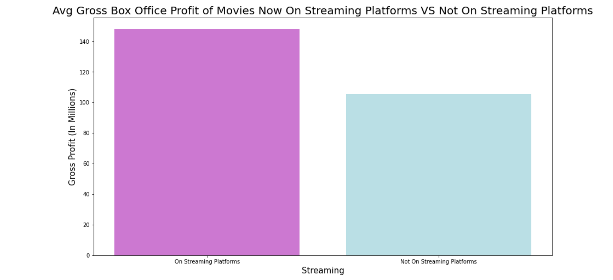
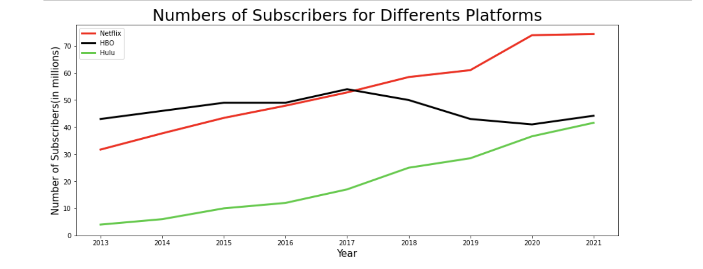
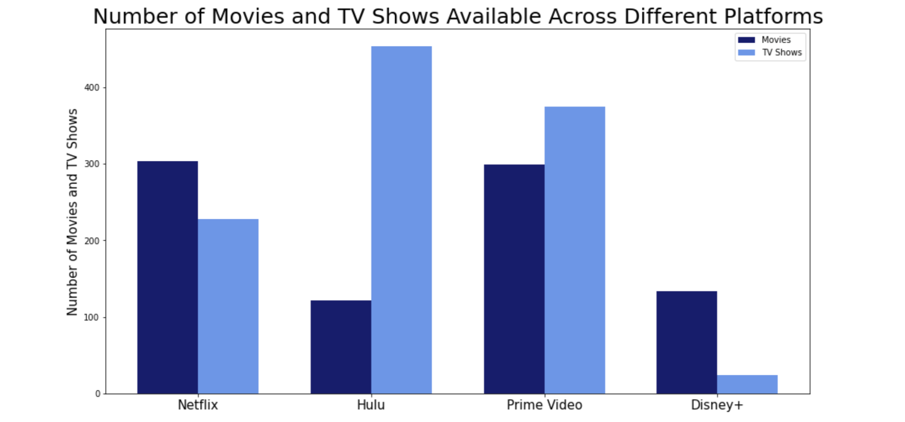

# Microsoft Film Industry and Streaming Platform Analysis

## Authors:
Mallory Wilson, CeCe Lacey, Qiwen Ou

# Overview 

This project will analyze what way Microsoft should join the movie industry. Microsoft sees that its competitors are creating their own film content which lead Microsoft to want to create a movie studio. Throughout this project we found data on the number of movie box tickets being sold yearly, the number of subscriptions to different streaming services yearly, the revenue that streaming services are making yearly, what movies or tv shows are on streaming services, and what movies made the most profit and if they were on streaming services or only in theatre. We have decided that Microsoft should make their own streaming service and put their movies on the streaming service. This is because the data tells us that not as many people are going to the movies and buying tickets, but more people are subscribing to streaming services. We think Microsoft would make reap more benefits if they created their own streaming service.

# Business Problem

Microsoft has noticed that its competitors have begun creating their own film content. So, Microsoft has decided to create a new movie studio, but they are unfamiliar with the film sector. However, the appearance of the streaming industry has altered the appeal for movie theatres. With this knowledge, should Microsoft invest in creating a movie studio or a streaming service? We want to know if people are still going to the movies or if streaming services are becoming more popular and making more money overall.

# Data


For this project, we used multiple datasets in order to make our case. We found data from The Numbers which gave us information on box office ticket sales over the past years. We found a lot of data from Statista giving us information on the growth of subscriptions to streaming platforms the past few years and a dataset telling us how much money streaming services have been making by year and which movies or tv shows are on which streaming platforms. Finally, we used the create_movies_db to get information on popular movies and compare these movies to ones that are found on different streaming services. All of this data relates to the business question because it helps us be able to tell whether streaming services are becoming more popular and if ticket sales to movies shown in theatres are decreasing.

# Methods

This project uses descriptive analysis, looking at movie and streaming service trends over time. We went on Kaggle and Statista to find information on the streaming service industry and movie theratre trends. We then went through the data and cleaned and organized it and then decided on how we wanted to display the information. This approach was taken because in order for us to look at multiple datasets and come up with a decision for Microsoft, we needed to be able to see multiple trends over multiple years.

# Results

The number of tickets sold hit its peak in 2002. After 2002, there is a slight decline in the number of tickets sold. Starting in 2018, there is a rapid decline and we can see that COVID impacted the number of ticket sales greatly, due to the huge decline in 2020. With as large of an impact that COVID had, it is unlikely that ticket sales will ever get as high as they used to be.


On average, movies that are found on streaming services make a higher gross profit than movies that are not on streaming platforms. Movies that are making a lot of money are more likely to be on streaming services.


The number of people subscribing to streaming services have been and still are increasing, including Hulu, HBO, and Netflix.


The revenue that streaming services are making from the increase in subscribers has been steadily increasing since 2011 and is still increasing.


Successful platforms have both movies and tv shows available for streaming.


# Conclusions
After analyzing all of this data, we have come up with three recommendations for Microsoft:

1. Do not create a movie studio.
2. Create a streaming platform.
3. Have both movies and tv shows on the streaming platform to get the most subscribers.
We make these recommendations because there has been a decline in the amount of people going to the movies but an increase in the number of streaming service subscriptions and revenue. We also found that these platforms are the most successful if they have both movies and tv shows.

# For More Information

Please review our full analysis in our [Jupyter Notebook](./CQM_Phase1_Project.ipynb) or our [presentation](./Phase_1_PPT.pdf). For any additional questions please contact Mallory Wilson at mallorye1103@gmail.com, CeCe Lacey at cecelacey@gmail.com, Qiwen Ou at qwin.ou0721@gmail.com.

# Repository Structure
```
├── README.md                           <- The top-level README for reviewers of this project
├── CQM_Phase1_Project.ipynb   <- Narrative documentation of analysis in Jupyter notebook
├── DS_Project_Presentation.pdf         <- PDF version of project presentation
├── data                                <- Both sourced externally and generated from code
└── images   
